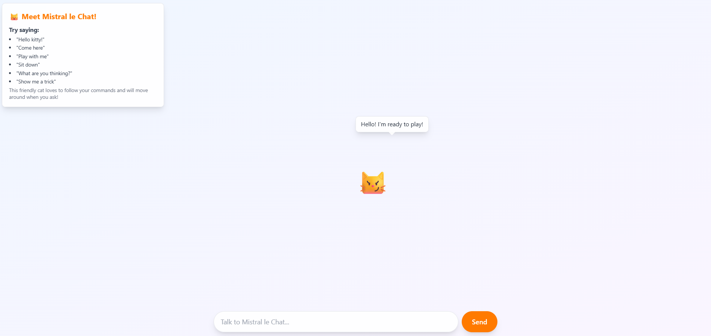
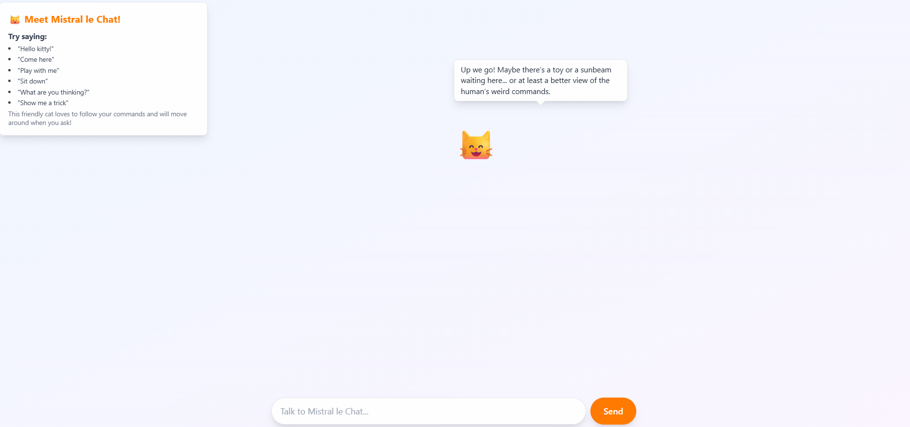

# Mistral le Sassy Chat

An AI-powered cat that lives on your webpage. Chat with Mistral's mascot and watch it respond to your commands - powered by Mistral AI's models for intelligent, context-aware interactions.

## 🐱 Screenshots

### The Cat's Wisdom
*When asked about the meaning of life, our sassy cat has some profound thoughts to share:*


### More Interactions





---

## Quick Start 

**⚠️ IMPORTANT**: Set up your environment file before running Docker:

1. **Copy the environment template:**
   ```bash
   cp .env.example .env
   ```

2. **Get your API key** from [Mistral AI Console](https://console.mistral.ai/)

3. **Edit the .env file** and add your API key:
   ```bash
   # Open .env and replace with your actual API key
   MISTRAL_API_KEY=your_actual_api_key_here
   ```

4. **Start the application:**
   ```bash
   docker-compose up
   ```

Visit `http://localhost:3000`

## Local Development (Non-Docker)

For local development without Docker, follow these steps:

### Prerequisites

- **Node.js 18+** - [Download here](https://nodejs.org/)
- **Python 3.8+** - [Download here](https://python.org/)
- **Git** - [Download here](https://git-scm.com/)

### Step 1: Clone and Setup

```bash
# Clone the repository
git clone <repository-url>
cd mistral-le-sassy-chat


# Or if you already have the project locally
cd mistral-le-sassy-chat
```

### Step 2: Environment Configuration

**⚠️ IMPORTANT: Set up your API key before starting the servers**

#### For Local Development:
```bash
# Copy the example environment file
cp .env.example .env

# Edit the .env file and add your Mistral API key
# Replace 'your_mistral_api_key_here' with your actual API key
```

#### For Docker:
```bash
# Copy the example environment file for Docker
cp .env.example .env

# Edit the .env file and add your Mistral API key
# Replace 'your_mistral_api_key_here' with your actual API key
```

#### Get Your Mistral API Key:
1. Go to [Mistral AI Console](https://console.mistral.ai/)
2. Sign up or log in to your account
3. Navigate to API Keys section
4. Create a new API key
5. Copy the key and paste it in your `.env` file

**Example .env file:**
```bash
MISTRAL_API_KEY=sk-1234567890abcdef...
```

### Step 3: Backend Setup

```bash
# Navigate to backend directory
cd backend

# Install Python dependencies
pip install -r requirements.txt

# Start the backend server
python main.py
```

The backend will start at `http://localhost:8000`

### Step 4: Frontend Setup

Open a **new terminal** and run:

```bash
# Navigate to frontend directory
cd frontend

# Install Node.js dependencies
npm install

# Start the frontend development server
npm run dev
```

The frontend will start at `http://localhost:3000`

### Step 5: Access the Application

- **Frontend**: http://localhost:3000 (Main application)
- **Backend API**: http://localhost:8000 (API endpoints)
- **API Documentation**: http://localhost:8000/docs (Swagger UI)

### Troubleshooting

**Missing API Key Error (Docker):**
```bash
# If backend container fails to start with "MISTRAL_API_KEY environment variable is required"
# Make sure you have a .env file with your API key:

# Copy the example file and edit it
cp .env.example .env
# Then edit .env and add your actual API key:
# MISTRAL_API_KEY=your_actual_api_key_here

docker-compose up
```

**Missing API Key Error (Local Development):**
```bash
# If you see "MISTRAL_API_KEY environment variable is required"
# Make sure you've created the .env file with your API key
cp .env.example .env
# Then edit .env and add your API key
```

**Port Already in Use:**
```bash
# Kill processes on ports 3000 or 8000
npx kill-port 3000
npx kill-port 8000
```

**Backend Dependencies Issues:**
```bash
# Create virtual environment (recommended)
python -m venv venv
source venv/bin/activate  # On Windows: venv\Scripts\activate
pip install -r requirements.txt
```

**Frontend Dependencies Issues:**
```bash
# Clear cache and reinstall
rm -rf node_modules package-lock.json  # On Windows: rmdir /s node_modules & del package-lock.json
npm install
```

## Development Setup

### Backend
```bash
cd backend
python main.py
```

### Frontend
```bash
cd frontend
npm run dev
```

## Features

- **Intelligent Chat**: Powered by Mistral AI's medium model for natural conversations
- **Real-time Interaction**: WebSocket-based communication for instant responses
- **Movement Commands**: Tell the cat to move around the screen with natural language
- **Cat Personality**: Responds with different moods and actions based on your messages
- **Clean Architecture**: Well-structured, maintainable codebase
- **No Autonomous Behavior**: Cat only responds when you interact with it

## Architecture

- **Frontend**: Next.js 14 + TypeScript + Tailwind CSS + Framer Motion
- **Backend**: FastAPI + WebSockets + Mistral AI API
- **Real-time Communication**: Socket.IO for instant cat responses
- **Deployment**: Docker Compose support

---

## Frontend Structure

The frontend is built with Next.js 14 and follows modern React patterns with TypeScript.

### Directory Structure

```
frontend/
├── app/                    # Next.js 14 app directory
│   ├── layout.tsx         # Root layout with global styles
│   ├── page.tsx           # Main page component
│   └── globals.css        # Global CSS and Tailwind styles
├── components/             # React components
│   ├── Cat.tsx            # Animated cat display component
│   ├── CatWorld.tsx       # Main container with cat and chat
│   ├── ChatInput.tsx      # Chat input form component
│   └── Instructions.tsx   # Help instructions overlay
├── hooks/                  # Custom React hooks
│   └── useSocket.ts       # WebSocket communication hook
├── package.json           # Dependencies and scripts
├── tailwind.config.js     # Tailwind CSS configuration
├── tsconfig.json          # TypeScript configuration
└── next.config.js         # Next.js configuration
```

### Key Components

- **CatWorld.tsx**: Main container managing cat state and chat interactions
- **Cat.tsx**: Animated cat display with position, mood, and action states
- **ChatInput.tsx**: Form for sending messages to the cat
- **Instructions.tsx**: User guidance overlay with command examples
- **useSocket.ts**: Custom hook for WebSocket communication with backend

### Features

- **Real-time Chat**: Instant communication with WebSocket integration
- **Responsive Design**: Works on desktop and mobile devices
- **Smooth Animations**: CSS-based animations for cat movements and actions
- **Type Safety**: Full TypeScript implementation for better development experience
- **Clean UI**: Modern design with Tailwind CSS

---

## Backend Structure

The backend follows a clean, modular architecture with proper separation of concerns.

### Directory Structure

```
backend/
├── api/                    # API routes and endpoints
│   ├── __init__.py
│   └── cat_routes.py      # Cat-related API endpoints
├── core/                   # Core application components
│   ├── __init__.py
│   ├── models.py          # Pydantic models and data structures
│   └── websocket.py       # WebSocket connection management
├── services/               # Business logic and external services
│   ├── __init__.py
│   ├── cat_service.py     # Cat state and interaction management
│   └── mistral_ai_service.py  # Mistral AI API integration
├── config/                 # Configuration and settings
│   ├── __init__.py
│   └── settings.py        # Application settings and environment variables
├── utils/                  # Utility functions and helpers
│   ├── __init__.py
│   └── helpers.py         # Common utility functions
├── main.py                # Application entry point
├── requirements.txt       # Python dependencies
└── Dockerfile            # Docker configuration
```

### Key Components

#### API Layer (`api/`)
- **cat_routes.py**: Contains all cat-related endpoints including chat and state management
- Clean FastAPI router structure with proper HTTP methods and response models

#### Core Layer (`core/`)
- **models.py**: Pydantic models for type safety and validation
- **websocket.py**: WebSocket manager for real-time communication with frontend

#### Services Layer (`services/`)
- **cat_service.py**: Manages cat state and coordinates interactions
- **mistral_ai_service.py**: Handles all Mistral AI API communication and response processing

#### Configuration (`config/`)
- **settings.py**: Centralized configuration management with environment variables

#### Utilities (`utils/`)
- **helpers.py**: Common utility functions used across the application

### Benefits of This Structure

1. **Separation of Concerns**: Each layer has a specific responsibility
2. **Maintainability**: Easy to locate and modify specific functionality
3. **Testability**: Each component can be tested independently
4. **Scalability**: Easy to add new features without affecting existing code
5. **Clean Imports**: Clear dependency structure and import statements

---

## API Documentation

### REST Endpoints

- `GET /api/`: Health check endpoint
- `GET /api/cat/state`: Get current cat state (position, mood, action, thought)
- `POST /api/chat`: Send chat message to cat and receive response

### WebSocket Events

- `connect`: Client connection established
- `disconnect`: Client disconnection
- `cat_response`: Cat response to chat messages with updated state

### Response Format

```json
{
  "text": "Cat's response message",
  "action": "sitting|walking|playing|sleeping|grooming|stretching",
  "thought": "Cat's internal thought",
  "mood": "playful|sleepy|curious|aloof|hungry",
  "new_position": {"x": 50, "y": 50},
  "state": {
    "position": {"x": 50, "y": 50},
    "mood": "playful",
    "action": "sitting",
    "thought": "Hello! I'm ready to play!",
    "last_interaction": "2025-09-22T19:00:00"
  }
}
```

---

## Environment Setup

### Prerequisites

- **Node.js 18+** for frontend development
- **Python 3.8+** for backend development
- **Mistral AI API Key** for AI integration

### Environment Variables

Create a `.env` file in the backend directory:

```env
MISTRAL_API_KEY=your_mistral_api_key_here
```

Or use the hardcoded key in `config/settings.py` (current setup).

### Installation

1. **Clone the repository**
   ```bash
   git clone <repository-url>
   cd Mistral-Project
   ```

2. **Install Backend Dependencies**
   ```bash
   cd backend
   pip install -r requirements.txt
   ```

3. **Install Frontend Dependencies**
   ```bash
   cd frontend
   npm install
   ```

4. **Start Development Servers**
   ```bash
   # Terminal 1 - Backend
   cd backend
   python main.py

   # Terminal 2 - Frontend  
   cd frontend
   npm run dev
   ```

5. **Access the Application**
   - Frontend: http://localhost:3000
   - Backend API: http://localhost:8000
   - API Documentation: http://localhost:8000/docs

---

## Usage

### Chat Commands

The cat understands natural language commands:

- **Movement**: "come here", "move up/down/left/right", "go to center"
- **Greetings**: "hello", "hi", "how are you"
- **Actions**: "sit down", "play with me", "show me a trick"
- **General**: Any message will get a contextual response

### Cat Behaviors

- **Actions**: walking, sitting, sleeping, playing, grooming, stretching
- **Moods**: playful, sleepy, curious, aloof, hungry
- **Movement**: Responds to directional commands and stays within screen bounds
- **Personality**: Maintains context and responds appropriately to conversation

---

## Technical Details

### Mistral AI Integration

- **Model**: mistral-medium-2508 for intelligent responses
- **Features**: JSON-structured responses, action/mood validation
- **Fallback**: Smart local responses when API is unavailable
- **Rate Limiting**: Graceful handling of API limits

### WebSocket Communication

- **Real-time**: Instant communication between frontend and backend
- **Event-driven**: No polling or continuous requests
- **Reliable**: Automatic reconnection and error handling

### State Management

- **Centralized**: Cat state managed in backend service layer
- **Reactive**: Frontend updates instantly via WebSocket events
- **Persistent**: State maintained throughout session

The cat will respond to your messages and move around the screen based on your commands!